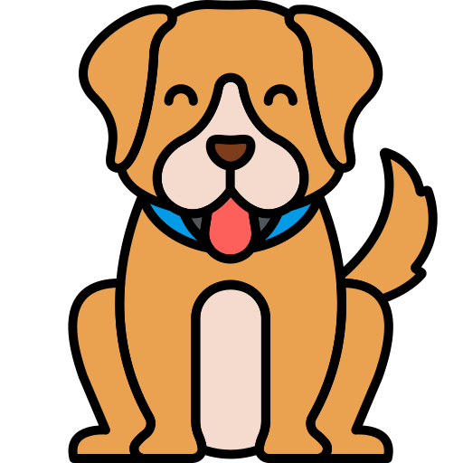

# Memory Match

Memory Match is a classic memory game where players flip over cards to find matching pairs. The game is designed with a playful, child-friendly aesthetic, making it appealing to players of all ages. Players click on two cards at a time: if the cards match, they remain face-up; if they do not match, they are turned back over.

The scoring system starts each game at 100 points, with 5 points subtracted for each mismatch. Players are encouraged to remember card positions carefully to maintain a high score.

[View live project here:]

---

## Table of Contents
1. [User Experience (UX)](#user-experience-ux)
   - [Target Audience](#target-audience)
   - [User Stories](#user-stories)
     - [Player Goals](#player-goals)
     - [Game Flow Goals](#game-flow-goals)
   - [Accessibility](#accessibility)
     - [Screen Reader Support](#screen-reader-support)
     - [Semantic HTML](#semantic-html)
     - [Form Accessibility](#form-accessibility)
     - [Visual Accessibility](#visual-accessibility)
     - [Future Improvements](#future-improvements)
2. [Design](#design)
   - [Layout](#layout)
   - [Colour Scheme](#colour-scheme)
   - [Typography](#typography)
   - [Responsive Design](#responsive-design)
3. [Features](#features)
   - [Current Features](#current-features)
     - [Header & Navigation](#header--navigation)
     - [Welcome Form](#welcome-form)
     - [Gameboard](#gameboard)
     - [Card Mechanics](#card-mechanics)
     - [Matching Logic](#matching-logic)
     - [Scoreboard](#scoreboard)
     - [End Screen](#end-screen)
     - [Modals](#modals)
     - [Play Again / New Game](#play-again--new-game)
   - [Future Features](#future-features)
4. [Technologies Used](#technologies-used)
   - [Core Technologies](#core-technologies)
   - [Tools & Resources](#tools--resources)
5. [Development Process](#development-process)
6. [Development & Deployment](#development--deployment)
   - [GitHub Pages](#github-pages)
   - [Updating the Deployment](#updating-the-deployment)
7. [Testing](#testing)
   - [Manual Testing](#manual-testing)
   - [Functionality Testing](#functionality-testing)
   - [Accessibility Testing](#accessibility-testing)
   - [Error Handling Testing](#error-handling-testing)
   - [Performance Testing](#performance-testing)
   - [Responsive Testing](#responsive-testing)
   - [Lighthouse](#lighthouse)
   - [Browser Testing](#browser-testing)
   - [Code Validation](#code-validation)
   - [Bugs & Fixes](#bugs--fixes)
     - [cardsArray Issue](#cardsarray-issue)
     - [Score UI Not Resetting](#score-ui-not-resetting)
     - [Shuffle Logic for Cards](#shuffle-logic-for-cards)
8. [Known Bugs](#known-bugs)
9. [Credits](#credits)
   - [Code](#code)
   - [Content](#content)

---

# User Experience (UX)

## Target Audience
The target audience for this memory game is users who enjoy simple, casual games and want to challenge or improve their memory.

They are most likely to:
- want a quick and easy game that is simple to understand
- play in short sessions, for example during breaks or free time
- appreciate a playful and visually engaging design
- access the game on different devices, including mobile and tablet

The game is designed to be accessible to a wide audience rather than a specific group. Since memory games are familiar to most people, it can appeal to both children and adults.

To make the experience more inclusive and child-friendly, the design uses:
- bright and playful colors
- simple and recognizable icons (such as animals and everyday objects)

At the same time, the scoring system (losing points for incorrect matches) adds a small challenge, making the game engaging even for older users who want to test their memory and improve their performance.

## User Stories

### User Experience Goals
The main goal of the game is to provide a simple, intuitive, and playful experience.
The design focuses on clarity and ease of use, while still offering a small level of challenge through scoring and memory-based gameplay.

### Player Goals

As a player I want to: 
- Quickly understand how the game works
- Start the game easily and without friction
- Play in a clean and non-distracting interface
- Be able to access rules or instructions at any time
- Track performance through moves, misses, and score
- Feel motivated through visual feedback (e.g. score changes)
- Improve memory and achieve a higher score
- Replay the game to try to perform better
- Allow a new player to start a fresh game

### Game flow goals

The following describes the expectation of how the user moves through the game and interacts with it:

1. Start Screen
- User enters their name
- User clicks the start button

2. Game Begins
- Cards are shuffled and displayed face down
- Score, moves, and misses are visible
- Score starts at 100 points

3.  Gameplay Interaction
- User clicks one card → it flips
- User clicks a second card → it flips

3. Matching Logic
- If cards match → they stay visible
- If cards do not match → they flip back and the user loses five points

4. Ongoing Feedback
- Moves, misses, and score update continuously
- Score changes color when it becomes low
- User can open rules at any time

5. Game End
- All pairs are matched
- Game board disappears
- End screen appears showing:
    * Final score
    * Total moves
    * Total misses

6. Next Actions
- User can choose to:
    * “Play Again” (same player)
    * “New Game” (return to start screen)

---

## Design
The design aims to create a fun and engaging experience without overwhelming the user. 
A clean and simple visual style was chosen to keep the focus on the gameplay. 
Some visual design ideas were inspired by another student [project](https://github.com/lowrycode/swaplett-project?tab=readme-ov-file) shown to me by my code facilitator, such as clean layout and playful typography. However, game logic and implementation were developed independently.

Colours and animations are used to enhance the user experience and provide feedback, 
such as the score changing colour as it decreases and different animations depending on whether the player wins or loses. 
The overall goal was to balance playfulness with clarity, ensuring that important information is always easy to see.

### Layout
Initial layouts were planned using Lucidchart for mobile, tablet, and desktop to ensure a responsive structure across different devices.

 
 	  
 

The layout is structured to guide the user through the game in a clear and intuitive way.
- A header contains the game title, logo, and access to the rules
- The start screen allows the user to enter their name before beginning the game
- The game board is centered on the page to maintain focus
- Game information such as moves, misses, and score is displayed clearly below the board
- An end screen appears after the game finishes, showing the result and options to restart or start a new game

### Colour Scheme
The color palette is divided into three groups, each serving a specific purpose:

1. **Base Colors** – These are neutral colors used for the background, text, borders, and surfaces. They provide contrast and ensure readability, making sure important information stands out against the background.

2. **Game-Enhancing Colors** – These colors are inspired by the logo and used to create a fun, playful feel. For example, gradients on the H1 heading and card fronts, hover effects on buttons, footer background, and the score/moves/misses display in the scoreboard. The secondary color is extracted directly from the logo using a color picker, ensuring a consistent visual identity across the interface. The aim was to consistently reuse colors across elements so that the interface feels cohesive and visually engaging.

3. **Feedback Colors** – These colors provide visual feedback based on game events. For example, the scoreboard colors gradually change as points decrease, and matched cards briefly turn green to indicate success. This helps players intuitively understand their performance without needing extra text instructions. The cards also get a lightgreen backgroundcolor when matched.

Overall, the palette was chosen to balance **playfulness** with **clarity**, ensuring the game is visually appealing while keeping important information easy to notice.

### Typography
Two fonts were chosen to create a balance between readability and playfulness. "Varela" is used for body text and interface elements, providing a simple style that doesn’t distract from gameplay. "Bangers" is used for the H1 heading, giving a fun feel to the logo and main titles. Both fonts were selected from Google Fonts to ensure web compatibility and a consistent look across devices.

Body font: Varela

 

Heading font (H1): Bangers

### Icons
The icons were selected from the Flaticon library with a focus on clarity, playfulness, and broad recognition. The goal was to create a visual style that feels lighthearted and accessible to players of all ages.

To achieve this, the icons represent a mix of familiar everyday objects—such as a dog, apple, and cupcake—combined with more fun and imaginative elements like a dinosaur and a wizard hat. This balance helps make the game both easy to understand and visually engaging.

The colorful and friendly design of the icons contributes to a playful user experience, reinforcing the game’s intention to feel enjoyable, simple, and inviting.

  
  
  
  
  
  
  
  

### Responsive Design
The responsive design ensures that the gameboard, scoreboard, and rules modal are displayed correctly across different devices, so the interface never interferes with gameplay. This project follows a mobile-first approach, where the game grid grows with the screen size.

The scoreboard is stacked vertically on mobile and small tablets, and displayed in a row on larger tablets and desktop screens. To achieve a consistent layout across devices, both standard breakpoints and custom breakpoints were used:

| Breakpoint     | Main Changes                                                                                                                                       |
| -------------- | -------------------------------------------------------------------------------------------------------------------------------------------------- |
| 425px          | Slightly larger H1 font and icons; gameboard cards grow from 70px → 90px.                                                                          |
| 480px          | Scoreboard info boxes and end-screen text increase in size; improved readability.                                                                  |
| 525px          | Gameboard cards grow to 100px with increased gaps; scoreboard switches from vertical stacking to horizontal layout.                                |
| 576px          | Typography scales up (H1, H2, paragraphs); header margins and nav gaps increase; start form switches to row layout; buttons and modal text larger. |
| 640px          | Gameboard cards grow to 120px; rules modal max-width increased for better display on tablets.                                                      |                                                                      |
| 1200px         | Gameboard cards expand to 130px; scoreboard gaps increase for desktop; overall layout more spacious.                                               |

The modals (popups) for rules and game info are scrollable and aligned at the top on smaller screens. On taller screens (above 700px in height), modals are centered vertically for a better visual experience.

### Intuitive Design & User Feedback
The game is designed to keep the player informed and motivated. Key elements of intuitive design and feedback include:

- Score feedback: The score changes color at set breakpoints (70, 50, 30) to give a clear visual cue of performance.
- Win/loss animations: Winning triggers a confetti effect; losing triggers rain and a gray background to signal failure.
- Card interactions: Cards slightly pop up on hover and stay flipped and green when matched, providing visual feedback.
- Rules accessibility: The rules modal is always available, helping players understand the game mechanics.
- Responsive feedback placement: Scoreboard, moves, and misses are visible and adapt to different screen sizes.

---

## Features & Game logic

### Current Features & logic

The game mechanics are designed around matching cards, tracking score, moves, and misses, and providing immediate visual feedback through colors and animations. Below, each feature is described in detail.

#### Navigation / Header
The header contains three main elements:

- Logo / Icon – A small image of two cards stacked. On hover, it slightly enlarges to indicate it is clickable. Currently, clicking the logo shows a brief summary of how the game is built; in future versions, it could open a popup with additional information about the game or game settings.

 

- Heading (H1) – Positioned in the center, using the playful gradient font to maintain visual identity.

- Rules Button – Positioned to the right, styled with the secondary color. On hover, the background turns white, and clicking it opens a modal with the game rules.

The header and navigation elements are responsive: they scale up or down depending on screen size, but their layout remains consistent across devices.

| Mobile 				 | Tablet 			  | Desktop 			  |
|----------------|----------------|-----------------|
|  |  |  |

#### Welcome Form
The welcome form allows the player to enter their name before starting the game. 
It consists of a simple design: an `<h2>` prompt “Enter your name”, an input field, and a “Start Game” button (white with a green hover effect). 
On mobile devices, the input field and button are stacked vertically, 
with the button spanning the same width as the input for a balanced look. 
On tablets and desktops, the input and button are displayed side by side, with the button slightly smaller than the input.

| Mobile 				 | Tablet & Desktop 								|
|----------------|----------------------------------|
|  |  |

When the player clicks the button, the startGame function is activated. 
The name entered in the form is saved as a variable for the duration of the game and used to personalize messages throughout the experience. 
For example, after clicking “Start Game”, the message “Let’s go, [playerName]!” is displayed above the gameboard. 
The name is also referenced in the end-of-game message, so the player sees a personalized message whether they win or lose. 
If the player chooses to play again, the same name is retained, maintaining the personalized experience.

The form also ensures the game does not start automatically when the page loads, giving more control over gameplay. 
In the future, using local storage could allow tracking multiple game sessions, creating a persistent scoreboard for the player.

### Gameboard
The gameboard is the main interactive area where the memory match game takes place. 
It consists of a grid of 12 cards that players can flip to reveal hidden images.

#### Layout:
The board is implemented as a CSS grid, initially 4×4 cards and is centered on the screen across all devices. 

 
    
    

#### Fetching Card-content (Icons)
The icons were chosen from the [flaticon library](https://www.flaticon.com/) and stored in a local JSON file. 
When the game starts, they are loaded using a fetch request, which returns a Promise. The code checks the response for errors before parsing it as JSON, and any errors are caught to display a message to the user. I chose a Promise-based fetch instead of async/await because the file is small and local, making this approach simple. However the async/await could also be used to make the execution order even clearer. 

#### Shuffling Logic
To create a fair and unpredictable game, the card deck is shuffled using a multi-step approach.

1. First, the original array of cards is duplicated to create pairs, ensuring that each card has exactly one matching counterpart. 

	`const halfA = [...cardArray]; ` `
 	const halfB = [...cardArray];`

2. These two arrays are then shuffled independently using the Fisher–Yates algorithm, which provides an efficient and unbiased randomization.

	`for (let i = arr.length - 1; i > 0; i--) { ` `
	const j = Math.floor(Math.random() * (i + 1)); ` `
	[arr[i], arr[j]] = [arr[j], arr[i]];
	}`

3. After shuffling, the two halves are interleaved into a single deck. 

	`if (Math.random() < 0.5) { ` `
  shuffledDeck.push(halfA[i], halfB[i]);` `
	} else {` >
  	shuffledDeck.push(halfB[i], halfA[i]);
	}`

4. To further improve randomness and avoid predictable patterns, an additional step performs random swaps across the deck. This reduces the likelihood of matching cards being placed directly next to each other.

	`if (
  	shuffledDeck[i] !== shuffledDeck[j] && ` `
  	shuffledDeck[i] !== shuffledDeck[j-1] && ` `
  	shuffledDeck[j] !== shuffledDeck[i+1]` `
	) { ` `
  	[shuffledDeck[i], shuffledDeck[j]] = [shuffledDeck[j], shuffledDeck[i]];
	}`

This layered approach ensures a balanced distribution of cards while maintaining a high level of randomness, resulting in a more engaging gameplay experience.

#### Rendering Cards
Once the card data has been fetched and shuffled, the game board is dynamically generated using JavaScript.

- Each card is created as a set of nested DOM elements representing the front and back sides. 
- The card’s identity is stored using a data attribute, making it easy to compare cards later in the game logic.
- For every card in the shuffled array, a new card element is constructed and appended to the game board. 
- An event listener is also attached to each card, allowing it to respond to user interaction by triggering the flip behavior.

By generating the cards dynamically instead of hardcoding them in HTML, the game becomes more flexible and scalable, making it easier to update or expand in the future.

#### Card Mechanics and card flipping
Each card consists of two sides: a front and a back. The back displays a gradient design, while the front reveals the card’s icon. 
This structure is implemented using nested elements and styled with CSS 3D transforms to create a smooth flip animation.

Visual feedback plays an important role in guiding the user: 
- Hovering over a card slightly scales it up to indicate interactivity, while clicking (or focusing) triggers the flip effect, revealing the card’s content.

- The flip behavior is controlled through JavaScript by toggling a flipped class on the selected card. 
- To maintain consistent game logic, the system keeps track of the first and second selected cards. 
- A locking mechanism (lockBoard) is used to temporarily disable interaction while two cards are being evaluated, preventing the player from flipping more than two cards at once.

This combination of visual feedback and controlled interaction ensures a smooth and intuitive gameplay experience.

#### Matching Logic:
Once two cards have been flipped, the game evaluates whether they form a matching pair.

Each card stores its identity using a data-name attribute. 
The comparison is handled in the checkMatch() function, where the values of the two selected cards are checked against each other.

If the cards match, they remain flipped, and a visual indicator is applied by adding a matched class, changing their appearance (light green) to signal success. The match counter is also increased, bringing the player closer to completing the game.

If the cards do not match, the game registers a miss. The score is reduced, and after a short delay, both cards are flipped back to their original state. During this delay, the board is temporarily locked to prevent additional interactions, ensuring that only two cards can be evaluated at a time.

This logic creates a clear feedback loop for the player, reinforcing successful matches while maintaining challenge through penalties for incorrect guesses.

#### Reset Logic
After each turn, the game resets the selected card state to prepare for the next interaction. This is handled by the resetFlippedCards() function.

Clears the references to the currently selected cards (firstCard and secondCard)
Unlocks the board by resetting the lockBoard variable
Ensures the player can continue interacting without unintended behavior

By explicitly resetting the game state after each evaluation, the logic remains predictable and prevents errors such as comparing incorrect cards or blocking further input.

#### Game End Condition
The game ends under two conditions:

Win: All card pairs have been successfully matched
Detected in checkMatch() when matches === cards.length
Loss: The player runs out of points (score reaches zero)

In both cases, the endGame() function is triggered, which transitions the interface from the game board to the end screen.

#### Scoreboard
The scoreboard provides real-time feedback on the player’s performance, tracking moves, misses, and score. 

It consists of three main variables:
- moves – counts the number of turns taken.
- misses – counts incorrect matches.
- score – starts at 100 and decreases by 5 for each miss.

Desktop: 

Mobile:

These variables are dynamically updated in the UI using the corresponding DOM elements (movesEl, missesEl, scoreEl). 
Every time a move is made or a miss occurs, the updateScoreUI() function is called to reflect the current state.

To enhance feedback, the score element changes color at certain thresholds:

Moderate score (70–50):

Medium score (50–30)

Low score (<30)

This visual cue allows players to quickly assess their performance and motivates careful matching. 
By combining numeric feedback with color indicators, the scoreboard creates an engaging and informative layer of game interaction.

#### End Screen
When the game ends, the interface transitions from the game board to a dedicated end screen, handled by the endGame() function.

The content and animations depend on the outcome:
Win scenario
- The player sees a personalized congratulatory message, e.g., 🎉 Well done [playerName]! 🎉
- Final statistics are displayed: score, total moves, and misses
- A confetti burst animation is triggered to visually celebrate the victory
Lose scenario
- A different personalized message is shown, e.g., 😢 Oh no [playerName]! You ran out of points. Try again!
- Score details are hidden to avoid confusion
- A rain effect combined with a background change reinforces the losing state

These visual and textual cues provide clear feedback to the player, 
marking the conclusion of the game and encouraging replayability.

#### Play Again / New Game Buttons
The game provides two options for restarting: Play Again and New Game, each tied directly to specific JavaScript functions.

Play Again
- Triggered by the playAgainBtn button.
- Calls the restartGame() function, which:
- Resets the game board and shuffles the cards (shuffleCards())
- Clears moves, misses, and score (resetGameData())
- Keeps the player’s name intact for a personalized experience
- Allows the player to quickly replay without re-entering their name

New Game
- Triggered by the newGameBtn button.
- Calls the newGame() function, which:
- Returns the player to the initial start screen (startSection)
- Clears all game data, including the player name and input field
- Hides game elements (gameBoard, gameInfo, welcomeMessage) for a fresh start

Both buttons ensure a smooth and predictable transition between game states, providing control over restarting while maintaining consistent gameplay logic.

#### Game State Management
The game maintains several key pieces of state to manage interactions and track progress. 

These variables work together to ensure smooth and predictable gameplay:
- firstCard / secondCard – Track the two cards currently flipped. Used to evaluate matches.
- lockBoard – Temporarily prevents further card flips while two cards are being compared, avoiding invalid interactions.
- moves / misses / score – Track player performance and are displayed on the scoreboard.
- matches – Counts how many pairs have been successfully matched, used to detect a win.
- playerName – Stores the player’s name for personalized messages.
- cards – Holds the deck of card objects fetched from the JSON file.

These state variables are updated by specific functions:
- flipCard() – Handles card selection and triggers match evaluation
- checkMatch() – Updates matches, moves, misses, and score
- resetFlippedCards() – Clears firstCard and secondCard after each turn
- restartGame() / newGame() – Reset the overall state depending on whether the player chooses to replay or start fresh

By centralizing game state in these variables and carefully controlling updates through functions, the game avoids unexpected behavior, ensures accurate score tracking, and provides a smooth player experience.

#### Modals
The game uses modals to display additional information without leaving the main interface, such as the rules or game info.

Rules Modal
- Triggered by the rulesBtn button
- Displays the game rules in a scrollable popup on smaller screens
- Can be closed by clicking the close button or clicking outside the modal

Game Info Modal
- Triggered by the logoBtn button
- Provides a brief summary of how the game is built

All modals use a combination of CSS and JavaScript to manage visibility and animations. 
When a modal is opened, a hidden class is removed, and when it is closed, the class is added back. 
This ensures smooth transitions and maintains a clean, responsive layout across devices.

Event listeners handle both button clicks and background clicks, preventing accidental interactions while keeping the user experience intuitive.

### Future Features

---

## Technologies Used

- HTML  
- CSS  
- JavaScript  

---

## Development & Deployment

### Development

### Deployment

---

## Testing

### Manual Testing

### Responsive Testing

---

## Known Bugs

---

## Credits

### Code

### Content
